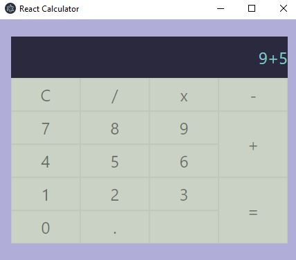

# Electron Apps

Small and simple applications made with ElectronJS.

## Getting started
Run the following commands for each project to run it
```
npm install 
npm run start
```
Run the following command to build an installer in the dist/ folder
```
npm run build-installer
```


## Applications

### Screen recorder
Simple screen recorder app to record a tab or screen, and then save it wherever you want as .webm file.


### System monitor
Small system monitor app that shows CPU usage, free memory, and total memory available.


### React calculator

Simple calculator made with ReactJS and Electron. This project could be used as a simple template for React and Electron, but lacks a bundler such as webpack.

Use the following command to create a development environment with React and Electron:
```
npm run dev
```


