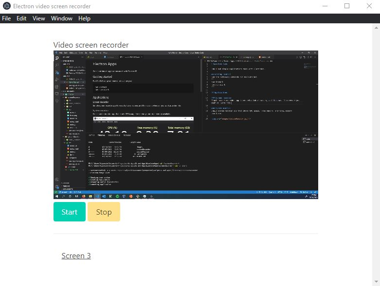
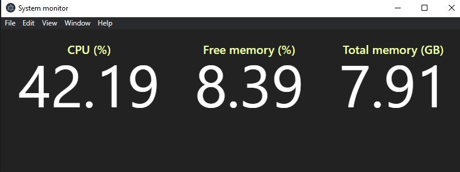

# Electron Apps

Small and simple applications made with ElectronJS.

## Getting started
Run the following commands for each project
```
npm install 
npm run start
```

## Applications

### Screen recorder
Simple screen recorder app to record a tab or screen, and then save it wherever you want as .webm file.



### System monitor
Small system monitor app that shows CPU usage, free memory, and total memory available.

